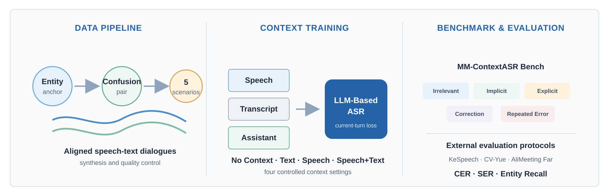

<div align="center">

# MM-ContextASR

### Multimodal Conversational Context for LLM-Based ASR

[](https://github.com/llh666521/MM-ContextASR/stargazers)
[](https://github.com/llh666521/MM-ContextASR)
[](https://huggingface.co/datasets/lilonghao/MM-ContextASR-Bench)
[](LICENSE)

[Data Pipeline](#data-pipeline) · [Context Training](#context-training) ·
[Benchmark & Evaluation](#benchmark--evaluation) · [Download](#download)

</div>

MM-ContextASR studies how spoken and textual dialogue history can improve
current-turn recognition in LLM-based ASR. The project brings together
scenario-controlled data construction, multimodal context training, and
entity-sensitive evaluation in a single framework.

<p align="center">
  
</p>

## Highlights

- **Data Pipeline:** A scenario-controlled pipeline for constructing entity-centric multimodal conversational contexts.
- **Context Training:** A unified training framework supporting text, speech, and joint speech-text dialogue histories.
- **Benchmark & Evaluation:** MM-ContextASR Bench for evaluating contextual ASR across diverse dialogue scenarios, complemented by reproducible protocols for KeSpeech, CV-Yue, and AliMeeting Far.

## Data Pipeline

<p align="center">
  
</p>

The pipeline proceeds through five stages: **entity selection**, **confusion
construction**, **dialogue generation**, **speech synthesis**, and **quality
control**. Accepted dialogues are packaged into aligned multimodal examples
without changing the order of user and assistant turns.

## Context Training

<p align="center">
  
</p>

Historical speech, its ASR transcript, and assistant responses are interleaved
in dialogue order before the current speech. Dialogue history is used only as
conditioning information, while the training loss is computed on the current
transcript.

| Setting | Historical speech | Historical transcript | Assistant text |
| --- | :---: | :---: | :---: |
| **No Context** | ✗ | ✗ | ✗ |
| **Text-only** | ✗ | ✓ | ✓ |
| **Speech-only** | ✓ | ✗ | ✓ |
| **Speech+Text** | ✓ | ✓ | ✓ |

## Benchmark & Evaluation

**MM-ContextASR Bench** is the benchmark released by this project. It contains
five controlled dialogue scenarios: **Irrelevant**, **Implicit**, **Explicit**,
**Correction**, and **Repeated Error**. Each aligned group keeps the current
speech, reference transcript, and target entity fixed while varying only the
dialogue history. The primary metric is entity recall.

<p align="center">
  
</p>

The paper additionally reports contextual ASR results on three existing
datasets. These evaluation interfaces are provided for reproduction and are
not part of MM-ContextASR Bench.

| Evaluation protocol | Test set | Metrics |
| --- | ---: | --- |
| KeSpeech | 19,212 | CER, SER, entity recall |
| CV-Yue | 3,525 | t2s CER, SER, entity recall |
| AliMeeting Far | 2,850 | target-speaker CER, SER |

## Download

Download the benchmark metadata and audio from
[Hugging Face](https://huggingface.co/datasets/lilonghao/MM-ContextASR-Bench):

```bash
git lfs install
git clone https://huggingface.co/datasets/lilonghao/MM-ContextASR-Bench
```

Or load a configuration directly with Hugging Face Datasets:

```python
from datasets import load_dataset

bench = load_dataset(
    "lilonghao/MM-ContextASR-Bench",
    "mm_contextasr",
    split="test",
)
```

The `kespeech`, `cv_yue`, and `alimeeting` configurations contain contextual
evaluation JSONL records with source audio identifiers. Audio from these
external datasets is not redistributed.

## Evaluation

Predictions use one JSON object per line:

```json
{"id": "example-id", "prediction": "recognized text"}
```

Run the lightweight scorer:

```bash
python evaluate.py \
  --references test.jsonl \
  --predictions predictions.jsonl
```

Use `--normalizer zh_t2s` for CV-Yue. The scorer reports CER, SER, entity
recall, and missing predictions when the corresponding annotations are
available.

## License

The code is released under [Apache-2.0](LICENSE). Dataset-specific terms are
listed on Hugging Face, and upstream licenses continue to apply to external
datasets.

## Citation

The paper link and BibTeX entry will be added when available.
