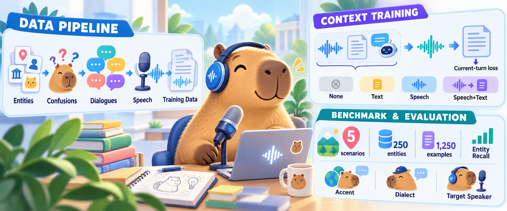
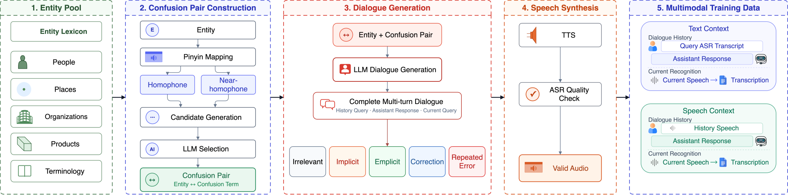
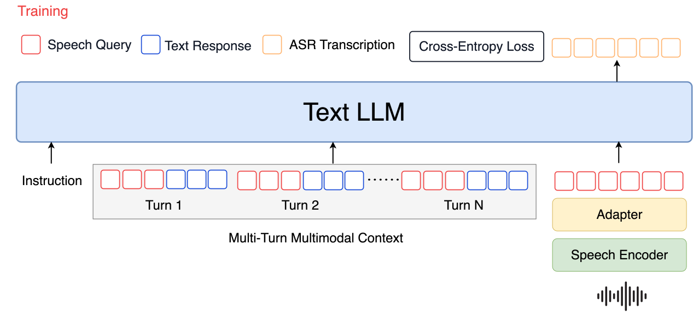
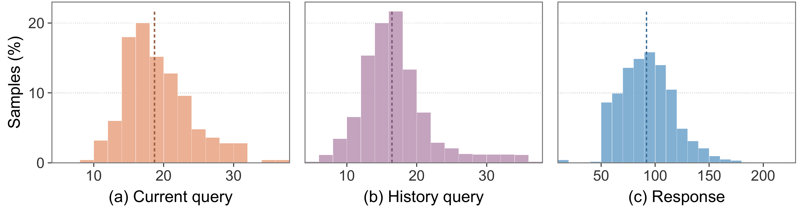

<div align="center">

# MM-ContextASR

### Multimodal Conversational Context for LLM-Based ASR

[](https://github.com/llh666521/MM-ContextASR/stargazers)
[](https://github.com/llh666521/MM-ContextASR)
[](https://huggingface.co/datasets/lilonghao/MM-ContextASR-Bench)
[](LICENSE)

[Data Pipeline](#data-pipeline) · [Context Training](#context-training) ·
[Benchmark & Evaluation](#benchmark--evaluation) · [Download](#download)

</div>

MM-ContextASR studies how spoken and textual dialogue history can improve
current-turn recognition in LLM-based ASR. The project brings together
scenario-controlled data construction, multimodal context training, and
entity-sensitive evaluation in a single framework.

<p align="center">
  
</p>

## Highlights

- **Data Pipeline:** A scenario-controlled pipeline for constructing entity-centric multimodal conversational contexts.
- **Context Training:** A unified training framework supporting text, speech, and joint speech-text dialogue histories.
- **Benchmark & Evaluation:** MM-ContextASR Bench for evaluating contextual ASR across diverse dialogue scenarios, complemented by reproducible protocols for KeSpeech, CV-Yue, and AliMeeting Far.

## Data Pipeline

<p align="center">
  
</p>

The pipeline proceeds through five stages:

- **Entity Selection:** Collect proper names and long-tail entities spanning people, places, organizations, products, and technical terms.
- **Confusion Construction:** Construct phonetically grounded ASR confusions from homophones and near-homophones, then select a plausible alternative for each entity.
- **Dialogue Generation:** Generate the current query and its dialogue history under five controlled contextual scenarios.
- **Speech Synthesis:** Synthesize historical and current user queries into speech and verify them through ASR retranscription.
- **Quality Control:** Filter degraded speech and structurally invalid dialogues before packaging the accepted samples into aligned multimodal examples.

## Context Training

<p align="center">
  
</p>

Historical speech, its ASR transcript, and assistant responses are interleaved
in dialogue order before the current speech. Dialogue history is used only as
conditioning information, while the training loss is computed on the current
transcript.

<table align="center">
  <thead>
    <tr>
      <th align="left">Setting</th>
      <th align="center">Historical<br>speech</th>
      <th align="center">Historical<br>transcript</th>
      <th align="center">Assistant<br>text</th>
    </tr>
  </thead>
  <tbody>
    <tr>
      <td><strong>No Context</strong></td>
      <td align="center">✗</td>
      <td align="center">✗</td>
      <td align="center">✗</td>
    </tr>
    <tr>
      <td><strong>Text-only</strong></td>
      <td align="center">✗</td>
      <td align="center">✓</td>
      <td align="center">✓</td>
    </tr>
    <tr>
      <td><strong>Speech-only</strong></td>
      <td align="center">✓</td>
      <td align="center">✗</td>
      <td align="center">✓</td>
    </tr>
    <tr>
      <td><strong>Speech+Text</strong></td>
      <td align="center">✓</td>
      <td align="center">✓</td>
      <td align="center">✓</td>
    </tr>
  </tbody>
</table>

## Benchmark & Evaluation

**MM-ContextASR Bench** is the benchmark released by this project. It contains
five controlled dialogue scenarios: **Irrelevant**, **Implicit**, **Explicit**,
**Correction**, and **Repeated Error**. Each aligned group keeps the current
speech, reference transcript, and target entity fixed while varying only the
dialogue history. The primary metric is entity recall.

<p align="center">
  
</p>

The paper additionally reports contextual ASR results on three existing
datasets. These evaluation interfaces are provided for reproduction and are
not part of MM-ContextASR Bench.

| Evaluation protocol | Test set | Metrics |
| --- | ---: | --- |
| KeSpeech | 19,212 | CER, SER, entity recall |
| CV-Yue | 3,525 | t2s CER, SER, entity recall |
| AliMeeting Far | 2,850 | target-speaker CER, SER |

## Download

Download the benchmark metadata and audio from
[Hugging Face](https://huggingface.co/datasets/lilonghao/MM-ContextASR-Bench):

```bash
git lfs install
git clone https://huggingface.co/datasets/lilonghao/MM-ContextASR-Bench
```

Or load a configuration directly with Hugging Face Datasets:

```python
from datasets import load_dataset

bench = load_dataset(
    "lilonghao/MM-ContextASR-Bench",
    "mm_contextasr",
    split="test",
)
```

The `kespeech`, `cv_yue`, and `alimeeting` configurations contain contextual
evaluation JSONL records with source audio identifiers. Audio from these
external datasets is not redistributed.

### External audio mapping

| Protocol | Source mapping | Same-speaker check |
| --- | --- | --- |
| KeSpeech | Match `current_audio_id` and `history[].audio_id` to exact basenames under the official KeSpeech audio root; released basenames are unique within this evaluation set. | Both IDs share the row-level `speaker_id`, also visible as the filename prefix. |
| CV-Yue | Resolve each ID as `clips/<audio_id>` in Common Voice Cantonese 26.0. | Current and history clips share the privacy-preserving row-level `speaker_id`. |
| AliMeeting Far | Resolve `Eval_Ali_far/audio_dir/<meeting_id>_<far_channel>.wav`, then extract the current and history intervals using their respective start/end timestamps. | Both intervals belong to the target `speaker_id`; history is a same-speaker enrollment segment and need not occur earlier in the meeting. |

For AliMeeting, the reference and current clips use different derived folders
but intentionally share a basename. `current_audio_id` identifies the derived
evaluation example rather than an original SLR119 recording. The Hugging Face
dataset card gives the complete field-level mapping contract.

## Evaluation

Each benchmark record contains the current utterance, its dialogue history,
the target entity, and scenario metadata. For example:

```json
{
  "id": "0013_implicit",
  "dataset": "mm_contextasr",
  "group_id": "0013",
  "scenario": "Implicit",
  "entity": "毛虾",
  "current_audio": "audio/current/0013.wav",
  "current_audio_id": "0013.wav",
  "current_transcript": "请问毛虾一般生活在什么海域？",
  "history": [
    {
      "role": "user",
      "audio": "audio/history/0263.wav",
      "audio_id": "0263.wav",
      "text": "对虾和基围虾哪个营养价值更高？"
    },
    {
      "role": "assistant",
      "text": "对虾蛋白质含量丰富，还含有多种矿物质，基围虾则脂肪含量较低、口感更鲜嫩。两者营养价值各有优势，选择时可以根据个人口味和需求来决定。"
    }
  ],
  "language": "zh-CN",
  "split": "test",
  "task": "contextual_asr",
  "source": {
    "audio": "generated",
    "corpus": "MM-ContextASR Bench"
  }
}
```

Submit predictions as one JSON object per line, matched by `id`:

```json
{"id": "0013_implicit", "prediction": "请问毛虾一般生活在什么海域？"}
```

Run the lightweight scorer:

```bash
python evaluate.py \
  --references test.jsonl \
  --predictions predictions.jsonl
```

Use `--normalizer zh_t2s` for CV-Yue. The scorer reports CER, SER, entity
recall, and missing predictions when the corresponding annotations are
available.

## License

The code is released under [Apache-2.0](LICENSE). Dataset-specific terms are
listed on Hugging Face, and upstream licenses continue to apply to external
datasets.

## Citation

The paper link and BibTeX entry will be added when available.
